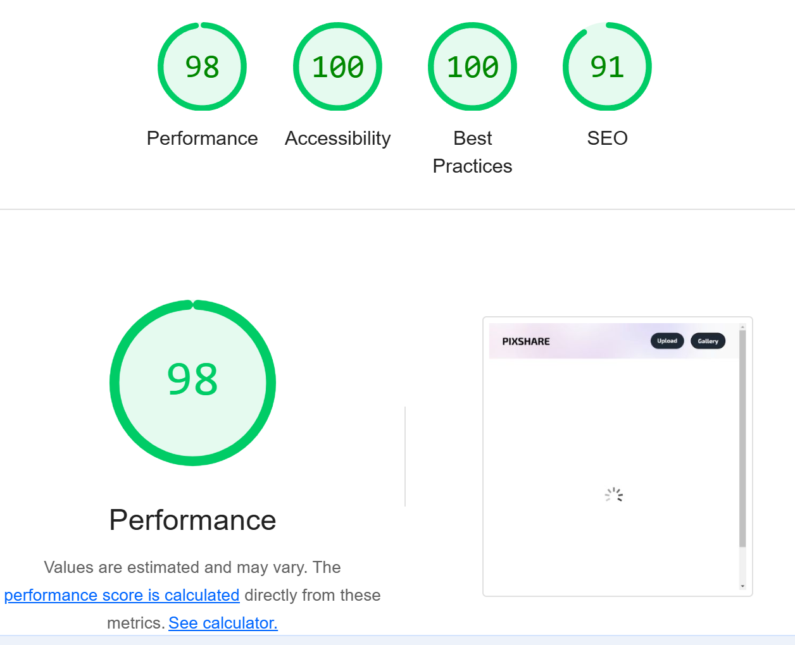
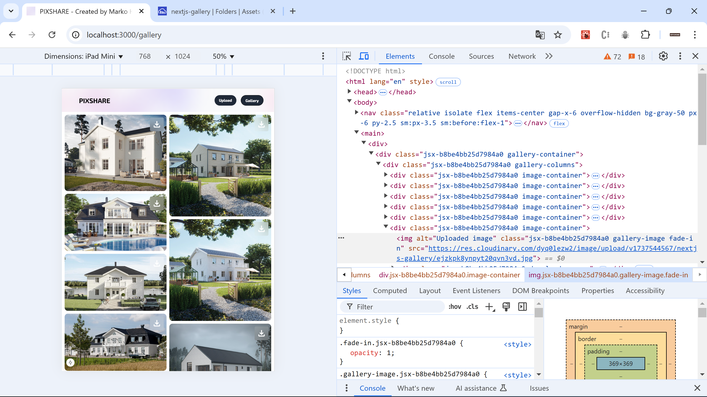
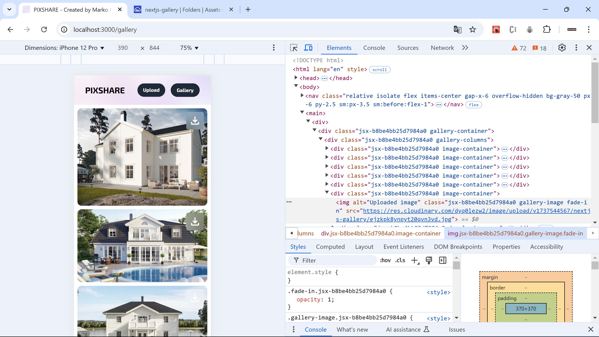
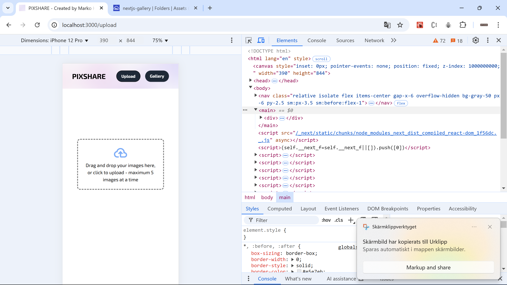
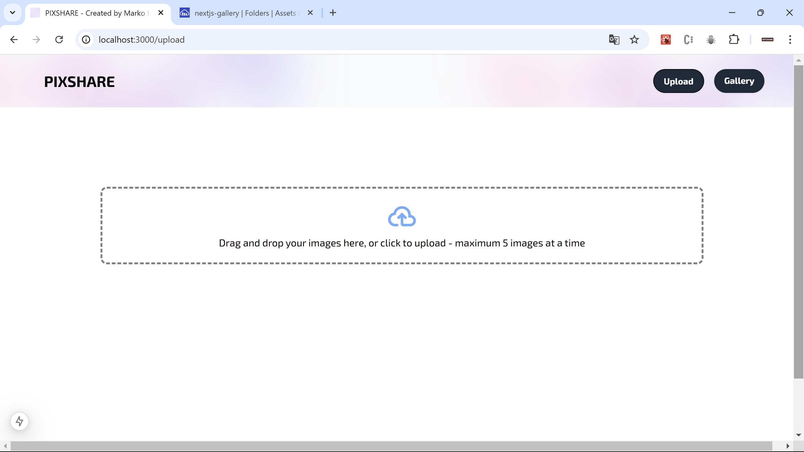
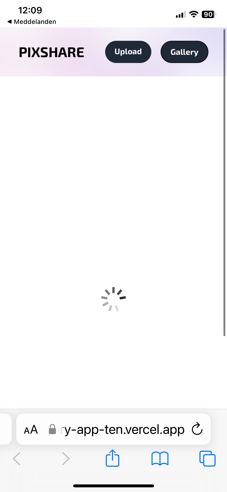
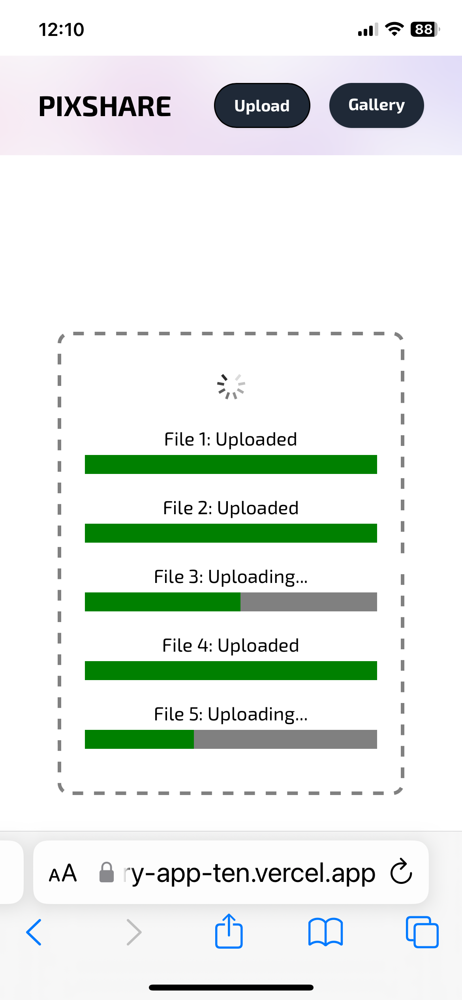

# Image Upload App

This is an image upload app built with **Next.js**, **React**, **Tailwind CSS**, and **Cloudinary**. It is deployed on **Vercel**.

## Tech Stack

- **Next.js**: Used for routing and server-side rendering.
- **React**: Used to build the app's UI.
- **Tailwind CSS**: Utility-first CSS framework used for styling the app.
- **Cloudinary**: Handles image uploads, storage, and delivery.
- **Vercel**: Deployed the app for hosting and fast deployments.

## Features

- **Drag-and-Drop Upload**: Allows you to drag images into the upload box or select them manually. Up to 5 images can be uploaded at once.
- **Upload Progress**: Displays the upload progress for each image.
- **Error Handling**: If an upload fails, an error message is shown.
- **Automatic Redirect**: After uploading, you're automatically redirected to a gallery page after a few seconds (URL is private for client use).

## Lighthouse Report

## How It Works

- **Uploading**: When a file is dropped or selected, it’s sent to the server using **`FormData`** and the **Fetch API**. The server then uploads the image to Cloudinary.
- **Progress**: The app tracks the upload progress and updates the progress bar in real-time.
- **Success**: Once the upload is complete, a success message is shown, and the app redirects to the gallery page after a few seconds.

### Example Images

#### Desktop View (Three Columns)

#### Middle-Sized Responsive Grid (Two Columns)

#### Mobile View (One Column)

#### Mobile View Upload Page

#### Desktop View Upload Page

#### Loading GIF (Fetching Images)

**Explanation of the Loading GIF:**
The loading GIF displayed on the upload page provides a visual indicator that the app is fetching images. This GIF animates while the server processes and retrieves the uploaded images. It ensures users are aware that content is being loaded and keeps the interface active while waiting. Once the images are successfully fetched, the GIF disappears, and the gallery appears.

#### Upload Progress Bars

**Upload Progress Bars Explanation:**
The progress bars provide users with real-time feedback on the status of their image uploads. They display the percentage of the file uploaded and help users track the process. If multiple images are uploaded at once, each image will have its own progress bar, allowing users to monitor each upload individually.

## Gallery Page Animation

**Explanation of the Gallery Page Animation:**
In the gallery page, there is a smooth animation that triggers when the user scrolls down. As the user scrolls, the images in the gallery fade in one by one. This animation effect makes the page feel dynamic and visually engaging, creating a smooth and interactive user experience. The fade-in effect is triggered by the scroll position and helps guide the user’s attention to each image as it appears. The animation is subtle and does not distract from the content but adds a polished touch to the gallery layout.

## Note

This app is hosted for personal use by the client, so I haven’t included the URL. However, I have tested everything using mockup images, and the functionality works as expected.

## How to Run Locally

1. Clone the repo.
2. Install the dependencies: `npm install`.
3. Start the development server: `npm run dev`.
4. Open the app in your browser at `http://localhost:3000`.

That's it. Let me know if you have any questions.
